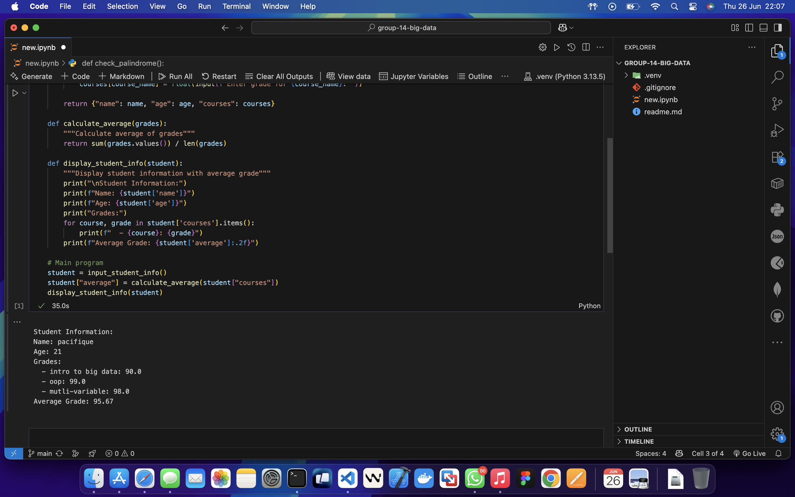
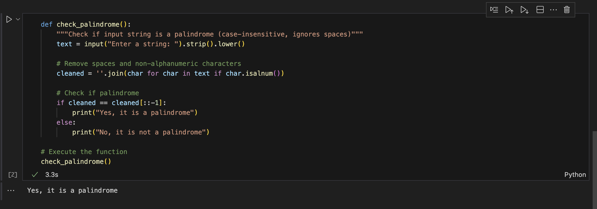

# Group 14 - Big Data Project

## Group Members
1. Pacifique bakundukize 26798
2. Member 2
3. Member 3
4. Member 4
5. Member 5
6. Member 6

---

## Problem Statement
This project aims to solve two programming problems using Python, focusing on user input, data processing, and string manipulation. The solutions are implemented in a Jupyter notebook and illustrated with screenshots for clarity.

---

## Question 1: Student Information and Average Grade

**Description:**
This program collects a student's name, age, and grades for 2 or 3 courses. It then calculates the average grade and displays all the information in a structured format.

**Explanation:**
- The user is prompted to enter their name and age.
- The user specifies the number of courses (2 or 3), then enters each course name and grade.
- The program calculates the average of the entered grades.
- All the information, including the average, is displayed in a readable format.

This solution demonstrates input handling, dictionary usage, and basic arithmetic operations in Python. See the screenshot above for an example of the program in action.

---

## Question 2: Palindrome Checker

**Description:**
This program checks if a given string is a palindrome, ignoring case and non-alphanumeric characters.

**Explanation:**
- The user is prompted to enter a string.
- The program removes spaces and non-alphanumeric characters, and converts the string to lowercase.
- It checks if the cleaned string reads the same forwards and backwards.
- The result is displayed, indicating whether the input is a palindrome or not.

This solution highlights string manipulation and logical comparison in Python. See the screenshot above for an example of the palindrome checker in use.

---

## Files
- `new.ipynb`: Contains the code for both questions.
- `qn1.png`: Screenshot for Question 1 (Student Information).
- `qn2.png`: Screenshot for Question 2 (Palindrome Checker).
